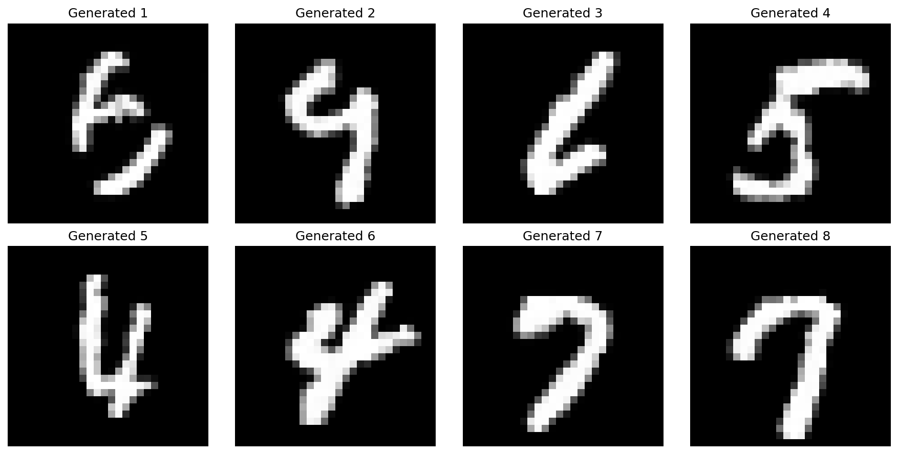
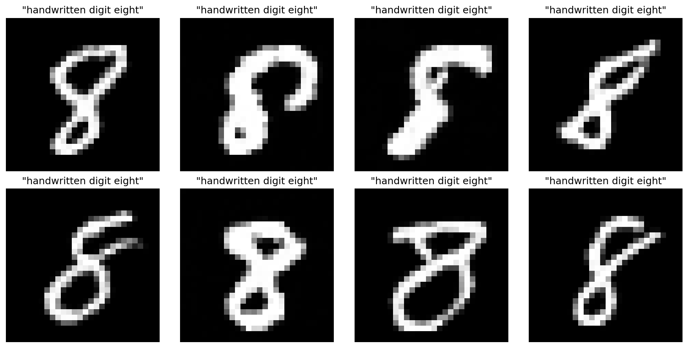

# Mini Text-to-Image Diffusion

A simple implementation of a text-to-image diffusion model for learning purposes. Currently generates MNIST digits from text prompts.

## Features

- **Unconditional generation**: Generate random MNIST digits
- **Text-conditioned generation**: Generate specific digits from text prompts
- **Simple architecture**: U-Net with diffusion scheduling
- **Text conditioning**: Basic text encoder with transformer layers

## Examples

The model can generate digits from prompts like:
- "handwritten digit five"
- "digit 7"
- "nine"

### Unconditional Generation (Random Digits)

### Text-Conditioned Generation

## Models

- **SimpleUNet**: Basic U-Net for unconditional diffusion
- **ConditionedUNet**: U-Net with text conditioning
- **DDPMScheduler**: Denoising diffusion probabilistic model scheduler
- **SimpleTokenizer**: Basic text tokenizer for MNIST prompts

## Status

✅ Working text-to-image diffusion for MNIST digits  
🚧 More features and improvements coming soon